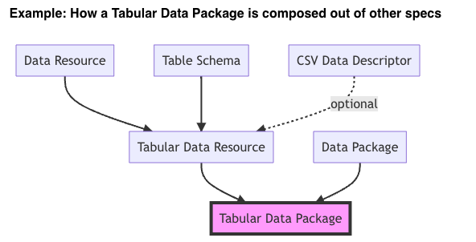

## Summary
The [frictionless data standard](https://specs.frictionlessdata.io/) is a general purpose structure for data that is designed to allow you to share data in a consistent format. Its designed to be simple and flexible while still meeting FAIR data standards. EHA has decided to use this as our default data standard for tabular data when a domain specific standard is not available. 



When working in R, we can use the [`frictionless R package`](https://docs.ropensci.org/frictionless/). Because the frictionless data standard leans heavily on json, the `frictionless R package` is built around manipulating lists. 


### Key terms:

[Tabular Data](https://specs.frictionlessdata.io/tabular-data-resource/) - Data represented as a table  
[FAIR Data](https://www.go-fair.org/fair-principles/) - Findable, accessible, interoperable and reusable data.  
[Data Package](https://specs.frictionlessdata.io/#what%E2%80%99s-a-data-package) - a standard way of storing metadata and data that is human editable and machine readable  
[Table Schema](https://specs.frictionlessdata.io/table-schema/#language) - describes how your tabular data are structured.  
[Types](https://specs.frictionlessdata.io/table-schema/#types-and-formats) - describes what kind of field is in the table using a controlled vocabular. Default is type string.  
*See also [Rich Types](https://specs.frictionlessdata.io/table-schema/#rich-types)*  
  
## Walk through with Airtable backup data

```{r Load Packages}
library(frictionless)
library(dplyr)

## read in csv data
people_table <- readr::read_csv("outputs/7ad5b06dbf0fc714d4b51f3ba7714fef/people.csv")

## create package and add resource
airtable_backup_package <- frictionless::create_package() %>%  
  add_resource(resource_name = "people_table",data = people_table )

frictionless::resources(airtable_backup_package)

```

Frictionless will add a `Table Schema` automatically. This schema is a list object that can be edited. 

```{r auto-schema}
airtable_backup_schema <- airtable_backup_package %>% 
  frictionless::get_schema(resource_name = "people_table")

str(airtable_backup_schema)

# see the field type for the id field
airtable_backup_schema$fields[[1]]$type

# set the field type as a universally unique id
airtable_backup_schema$fields[[1]]$type  <- "uuid"

```

Alternatively, you can create a schema on your own. 

[TODO - how do airtable/odk field types map to frictionless field types]


```{r create-schema}
# create a new schema
people_table_schema <- frictionless::create_schema(people_table)

# read in metadata from airtable

metadata <- readr::read_csv(file = "outputs/7ad5b06dbf0fc714d4b51f3ba7714fef/metadata.csv")

people_metadata <- metadata %>% 
  filter(table_name == "People") 
# add descriptions to schema items

people_table_schema$fields <- purrr::map(people_table_schema$fields,function(x){
  
  field_name_i <- x$name 
  field_desc  <- people_metadata %>% 
    mutate(field_name = snakecase::to_snake_case(field_name)) %>%
    filter(field_name == {{field_name_i}}) %>% 
    pull(field_desc)
  
  x$desciption <- field_desc
  
  return(x)
})

str(people_table_schema)

## add new schema to package

airtable_backup_package  <- airtable_backup_package %>% 
  # drop old resource
  frictionless::remove_resource("people_table") %>% 
  frictionless::add_resource(
    resource_name = "people_table",
    data = people_table,
    schema = people_table_schema) # explicitly adding the schema

```

Once you're satisfied with the state of your data package you can write it. 

```{r write-package}

output_dir <- sprintf("outputs/%s", rlang::hash(airtable_backup_package)) #probably give this a human readable name

dir.create(output_dir)

frictionless::write_package(package = airtable_backup_package,directory = output_dir)
```


Finally, validate your data package. The [validation tools](https://framework.frictionlessdata.io/docs/getting-started.html) are available in python and via the command line (CLI). 

CLI: 
```
frictionless validate outputs/d6006ad1ea537348a174da9aa4f186d2/people_table.csv
```


