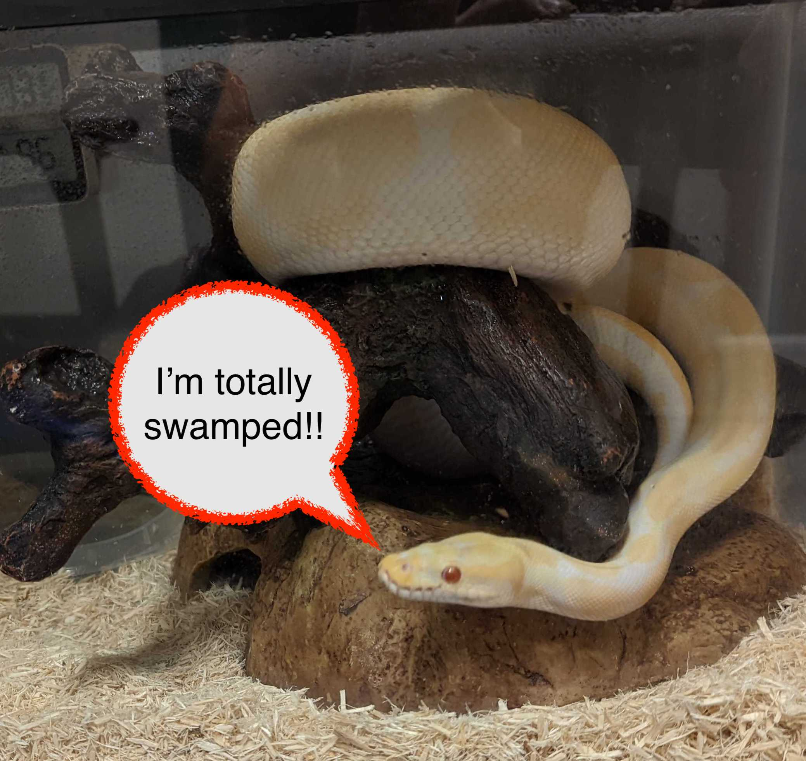

```{r setup, include=FALSE}
knitr::opts_chunk$set(echo = TRUE, fig.height=5, fig.align='center')
```

# Story time
.pull-left[
- EHA has setup a great R-centric tech stack for reproducible data analysis - `renv`, `targets`, github actions, the servers - all working together in harmony
- You find a paper describing a model, but the model is written in python!
- All of EHA's resident python experts are busy, and so is Mersenne
- What is a proficient R user to do? 
]

.pull-right[

]

---

# Potential solutions

- Learn enough python to run the model and pray your workflow also runs on someone else's machine
- Learn a lot of python and recreate aspects of the EHA stack so that you know your workflow is portable
- Use the `reticulate` package and run the model directly from R leveraging the full reproducibility stack

---

# What is `reticulate`?

.left-column[`reticulate` is an R package that allows you to call python from R.  

You can think of it like a translator between the two languages.  
]

.right-column[

]

---

# That sounds too easy

.pull-left[

]

.pull-right[

 It is more or less straightforward to use for most python functions.  
 
 The catch is setting up the python environment appropriately
]

---

# Setting up R to use the right version of python

First, figure out what `reticulate` thinks is the default version

```{r}
library(reticulate)
py_discover_config() 

```

---

# Setting up R to use the right version of python

If you would like to change the default you can setup your `.env` file to look like this:
```
RETICULATE_PYTHON="path/to/python"
# optionally set an environment to work from
RETICULATE_PYTHON_ENV="path/to/env"
```

---

# Setting up R to use the right version of python

You can also use built-in functions:
```
library(reticulate)
use_python("/usr/local/bin/python")
use_virtualenv("~/myenv")
use_condaenv("myenv")
```
---
# Setting up R to use the right version of python

Order of discovery:

1. Environment variable - if set, will override function calls
2. Built-in functions - if set, will override default
3. Default version of python - `reticulate` will setup an environment for you called "r-reticulate”

---

# How does this interact with `renv`?

`renv` is a dependency management system, if we are using reticulate we are adding python and all the installed packages as a project dependency.  

`renv` will:  

1. Record the python version used as an environment variable*
2. Record any python packages used
3. Reinstall recorded python packages

---

# How does this interact with `renv`?

`renv` has built in functions for setting the project level python version. If you skip this step you're going to have a bad time. Remember the order of discovery? Because `renv` creates an env variable, it will override any changes you make via reticulate.  

```
renv::use_python()


Please select a version of Python to use with this project: 

1: /opt/homebrew/Cellar/python@3.9/3.9.17/bin/python3.9
2: /opt/homebrew/Cellar/python@3.11/3.11.4/bin/python3.11
3: /opt/homebrew/Cellar/python@3.10/3.10.12/bin/python3.10
4: /opt/homebrew/bin/python3
5: /usr/bin/python3
```

---

# Should I use virtual environments or just the installed python versions?

Like using`renv`, using virtual environments allows you to separate project
dependencies and keeps you from messing up the default python installations on your machine. 

```
# in terminal
pip install virtualenv

# check your python version
which python3

# create virtual env -- will create a folder called bbr-env
python3 -m venv bbr-env

# activate virtual env
source bbr-env/bin/activate
```
---

# Use case: 

WISE EHA publication analysis is trying to the distribution of men and women in first and last authorship positions on publications. We have ~900 authorship items that require review. To facilitate data processing, we would like to use a pre-trained natural language processing model that classifies names as likely belonging to a man or woman. 


---

# Use case: Setting up renv

```
renv::use_python(name = "./bbr-env")

- Lockfile written to "~/Documents/building-blocks-of-reproducibility/renv.lock".
- Activated Python 3.11.4 [virtualenv; ./bbr-env]

Restarting R session...

- Project '~/Documents/building-blocks-of-reproducibility' loaded. [renv 1.0.3]
- The project is out-of-sync -- use `renv::status()` for details.

```

---

# Use case: Installing python packages


```
py_install("nomquamgender",pip = TRUE)

# Using virtual environment #'/Users/collinschwantes/Documents/building-blocks-of-reproducibility/bbr-e nv' ...
# Installing collected packages: pytz, unidecode, tzdata, six, numpy, python-dateutil, pandas, nomquamgender
# Successfully installed nomquamgender-0.1.4 numpy-1.26.2 pandas-2.1.3 python-dateutil-2.8.2 pytz-2023.3.post1 six-1.16.0 tzdata-2023.3 unidecode-1.3.7
```

---

# Use case: renv to capture dependencies

```
renv::snapshot()
...
- Lockfile written to "~/Documents/building-blocks-of-reproducibility/renv.lock".
The following will be written to requirements.txt:
- nomquamgender==0.1.4
- numpy==1.26.2
- pandas==2.1.3
- python-dateutil==2.8.2
- pytz==2023.3.post1
- six==1.16.0
- tzdata==2023.3
- Unidecode==1.3.7
```
---

# Use case: running the desired functions

```{r}
# load the package
nqg <- reticulate::import("nomquamgender")

# create model object using built in function from python library
model <- nqg$NBGC()

fake_names <- c("Jane Doe","Xi Lee","Muhammed Ali","Guillermina Cruz Diaz", "Robert F. Ackerman")

# Classify the names
model$annotate(names = fake_names,as_df = TRUE)

```
---

# Why use R and python?

.left-column[
- Different tools for different tasks
- Python has excellent ML/AI packages
- R has excellent statistics and data visualization packages
- Sometimes a collaborator just wants to work in one language or the other
]

.right-column[

]


---
# How do I use R in python?

.left-column[
- Important, but not the focus of this talk
- `rpy2` package 
- Allows python users to install and use R packages from an python environment
]

.right-column[

]


---
# How do I use python in R? 

* The `xaringan` package lets you make html presentations

* The `ehastyle` package creates consistent formatting for your presentation

* These can be used to create slide shows that dynamically update with your analysis

---

# A slide title

* These list items are 

* Place holders for your 

* Content

    - sub list item 1

    - sub list item 2

    - sub list item 3
    
---

# Here is some code

```{r eval=FALSE, message=FALSE, warning=FALSE}
library(ggplot2)
library(dplyr)
library(xaringanthemer)

ggplot2::diamonds %>%
    ggplot(aes(x = cut, y = carat)) +
    geom_violin() +
    theme_xaringan() +
    coord_flip()

```

---

# Here is the plot

```{r echo=FALSE, message=FALSE, warning=FALSE, fig.alt="an example plot from the diamonds dataset showing cut on the y axis and carat on the x axis"}
library(ggplot2)
library(dplyr)
library(xaringanthemer)

ggplot2::diamonds %>%
    ggplot(aes(x = cut, y = carat)) +
    geom_violin() +
    theme_xaringan() +
    coord_flip()

```
---

# Two column slide

.left-column[
- Any content
- You like
- On the left
]

.right-column[
```{r echo=FALSE, message=FALSE, warning=FALSE}
ggplot2::diamonds %>%
    ggplot(aes(x = cut, y = carat)) +
    geom_violin() +
    theme_xaringan() +
    coord_flip()
```
]

